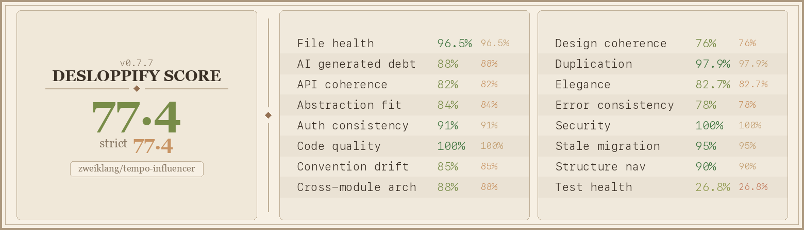

# Tempo Influencer

A locally-run web app for managing Tempo/Jira project budgets and worklogs. Connect your Jira instance and a Tempo financial project, review logged hours with billing rates, and use Budget Delta mode to calculate and post worklogs that hit a target revenue figure.



## Features

- **Settings** — Store Jira, Tempo, and Gemini API credentials encrypted at rest (AES-256-GCM, SQLite). Select the active Tempo financial project.
- **Worklogs** — View all hours logged against a project in a date range, grouped by team member and issue, with billing rates and revenue totals. Streams results progressively via SSE.
- **Team** — Inspect team members, their roles, billing rates, and per-role overrides. Assign team memberships.
- **Roles** — Create custom Tempo roles and write per-role descriptions. Optionally use Gemini AI to suggest role descriptions based on your team context.
- **Budget Delta** — 5-step wizard to hit a target revenue:
  1. Set a revenue target (with optional per-role hour caps)
  2. Configure participating roles and billing rates
  3. Map issues and assign them to roles
  4. Preview the generated hour schedule — hours distributed evenly across business days with jitter, respecting 8 h/day capacity
  5. Post worklogs to Tempo in bulk

## Stack

| Layer | Tech |
|-------|------|
| Frontend | React 18 + Vite, Tailwind CSS, shadcn/ui (Radix), TanStack Query v5, Zustand |
| Backend | Express + TypeScript (`tsx`), better-sqlite3, Zod |
| Auth storage | AES-256-GCM encrypted SQLite |
| AI (optional) | Google Gemini API — role description suggestions |

## Prerequisites

- Node.js ≥ 18 (tested on Node 25; requires better-sqlite3 ≥ 12.6.2)
- A Jira Cloud instance with API token
- A Tempo Cloud account with API token
- (Optional) A Google Gemini API key for AI-assisted role descriptions

## Setup

```bash
npm install
npm run dev
```

- Client: http://localhost:5173
- Server: http://localhost:3001

On first run, open **Settings** and enter your Jira URL, Jira email, Jira API token, and Tempo API token. Then select the Tempo financial project you want to work with.

## Production build

```bash
npm run build
npm start
```

## Project structure

```
client/src/
  pages/          # SettingsPage, WorklogsPage, TeamPage, RolesPage, BudgetDeltaPage
  components/ui/  # shadcn/ui components (badge, button, card, combobox, …)
  hooks/          # useSettings, useTeam, useWorklogs, …
  store/          # Zustand app store (activePeriod, activeTeamId, selectedProject)

server/src/
  routes/         # settings, project, team, issues, budget-delta
  services/       # tempoClient, jiraClient, geminiClient, crypto,
                  # billingRates, hourCalculator, worklogDistributor
  lib/            # math utilities (snapToHalf, SECONDS_PER_HOUR)
  db.ts           # SQLite schema + all query functions
```

## How worklog distribution works

Budget Delta computes how many hours each role needs to log to hit the revenue target, then distributes those hours across business days:

1. **Hour calculation** — `targetRevenue / billingRate` per role, with optional caps. Revenue lost to caps is redistributed to uncapped roles.
2. **Week clustering** — Hours are spread across 1–3 weeks (biased toward fewer weeks) to look natural rather than perfectly uniform.
3. **Daily distribution** — Within each picked week, hours are split across working days using a seeded PRNG with a 20–80% random fraction per day, with a 1 h minimum per entry and `snapToHalf` rounding.
4. **Capacity awareness** — Existing worklogs are fetched first; the distributor respects remaining daily capacity and never exceeds 8 h/day.
